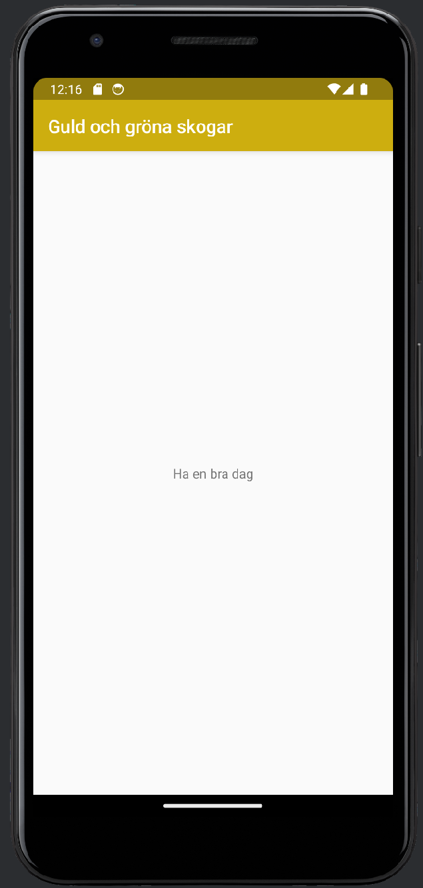

# Rapport

De ändringar som gjordes var att appnamnet till "Guld och gröna skogar" och sedan ändrades textview så att det står något annat och är mer passande appen.
Denna kod är dock hårdkodad och det finns bättre sätt att lägga till text för denna del.
Ännu en del som ändrades var färgerna för primärfärgen samt den mörka primärfärgen så att de passar appnamnet mer.

```
<resources>
    <color name="colorPrimary">#CDAE0F</color>
    <color name="colorPrimaryDark">#917B0D</color>
    <color name="colorAccent">#D81B60</color>
</resources>
```

```
<resources>
    <string name="app_name">Guld och gröna skogar</string>
</resources>
```


